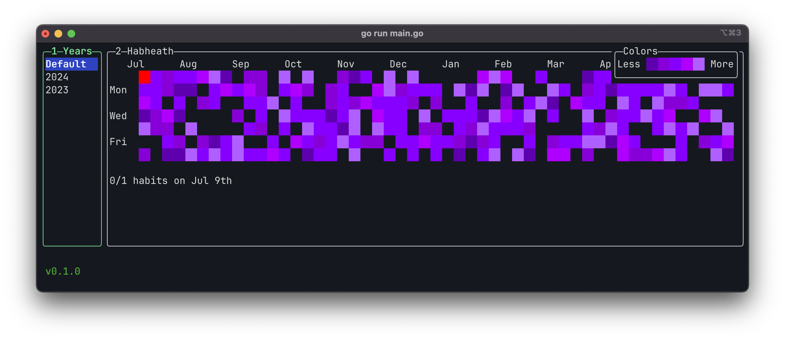

# Habheat
A simple terminal UI for habit tracking with Github like heat map.
- [Table of contents](#table-of-contents)
- [Features](#features)
  - [Compare two commits](#compare-two-commits)
- [Installation](#installation)
  - [Binary Releases](#binary-releases)
  - [Go](#go)
  - [Manual](#manual)
- [Usage](#usage)
- [Configuration](#configuration)
  - [Custom Theme](#custom-theme)
  - [Keybindings](#keybinding)
- [Contributing](#contributing)
  - [Debugging Locally](#debugging-locally)

## Installation

### Binary Releases
For Windows, Mac OS(10.12+) or Linux, you can download a binary release [here](https://github.com/metagunner/habheat/releases).

### Go
```sh
go install github.com/metagunner/habheat@latest
```

### Manual

You'll need to [install Go](https://golang.org/doc/install)

```
git clone https://github.com/metagunner/habheat.git
cd habheat
go install
```

You can also use `go run main.go` to run the application.

## Usage
Call `habheat` in your terminal.

```sh
$ habheat
```

## Configuration

Default path for the config file and the database:

- Linux: `~/.config/habheat/config.yml`
- MacOS: `~/Library/Application\ Support/habheat/config.yml`
- Windows: `%LOCALAPPDATA%\habheat\config.yml` (default location, but it will also be found in `%APPDATA%\habheat\config.yml`

<!-- START CONFIG YAML: AUTOMATICALLY GENERATED DO NOT UPDATE MANUALLY -->
### Defaults
```yaml
# Config relating to the Habheat UI
gui:
    # Config relating to colors and styles.
    theme:
        # Selected heat map color scheme.
        selected: green

        # Available heat map color schemes.
        colorSchemes:
            # Color scheme name. Write this to "selected" property.
            green:
                # Value for cell that is in the future or not available in the year.
                invalidDayValue: '  '

                # Value when the cell does not have any habits.
                noHabitsValue: '  '

                # Value when the cell does not have any completed habits.
                zeroCompletedHabitValue: '  '

                # color shades with ANSI codes, less to more
                statusValues:
                    1: "\e[48;5;22m  \e[0m"
                    2: "\e[48;5;29m  \e[0m"
                    3: "\e[48;5;34m  \e[0m"
                    4: "\e[48;5;40m  \e[0m"
                    5: "\e[48;5;118m  \e[0m"

                # Cursor value
                cursorValue: "\e[48;5;196m  \e[0m"

            # Blue color scheme
            ice:
                invalidDayValue: '  '
                noHabitsValue: '  '
                zeroCompletedHabitValue: '  '
                statusValues:
                    1: "\e[48;5;61m  \e[0m"
                    2: "\e[48;5;67m  \e[0m"
                    3: "\e[48;5;68m  \e[0m"
                    4: "\e[48;5;74m  \e[0m"
                    5: "\e[48;5;75m  \e[0m"
                cursorValue: "\e[48;5;196m  \e[0m"

            # Purple color scheme
            purple:
                invalidDayValue: '  '
                noHabitsValue: '  '
                zeroCompletedHabitValue: '  '
                statusValues:
                    1: "\e[48;5;55m  \e[0m"
                    2: "\e[48;5;92m  \e[0m"
                    3: "\e[48;5;93m  \e[0m"
                    4: "\e[48;5;129m  \e[0m"
                    5: "\e[48;5;135m  \e[0m"
                cursorValue: "\e[48;5;196m  \e[0m"

            # Yellow color scheme
            yellow:
                invalidDayValue: '  '
                noHabitsValue: '  '
                zeroCompletedHabitValue: '  '
                statusValues:
                    1: "\e[48;5;142m  \e[0m"
                    2: "\e[48;5;178m  \e[0m"
                    3: "\e[48;5;184m  \e[0m"
                    4: "\e[48;5;220m  \e[0m"
                    5: "\e[48;5;226m  \e[0m"
                cursorValue: "\e[48;5;196m  \e[0m"

        # Border color of focused window
        activeBorderColor:
            - green
            - bold
            
        # Border color of non-focused windows
        inactiveBorderColor:
            - default
```

### Built-in Color Schemes
These are all the available color schemes. The default one is *green*. You can change the color from configuration.
```yaml
gui:
    theme:
        selected: purple # The color scheme you want
```





### Customization
The built-in color schemes are uses ANSI color codes to support all terminals. Depending on your terminal support you can also use unicode characters.
#### Creating Custom Color Scheme
"Selected" property should be same with the name of the color scheme.
```yaml
gui:
  theme:
    selected: custom
    colorSchemes: 
      custom:
        invalidDayValue: "🚫"
        noHabitsValue: "  "
        zeroCompletedHabitValue: "  "
        statusValues:
          1: 😭
          2: 🥺
          3: 😎
          4: 😳
          5: 🤩
        cursorValue: 🖖

```


## Color Attributes

The available color attributes are:

**Colors**

- black
- red
- green
- yellow
- blue
- magenta
- cyan
- white

**Modifiers**

- bold
- default
- reverse # useful for high-contrast
- underline

## Keybindings
At the moment there are no custom keybindings. It is at the todos list.
<!-- For all keybinding options check [Keybindings](./Keybindings.md). -->